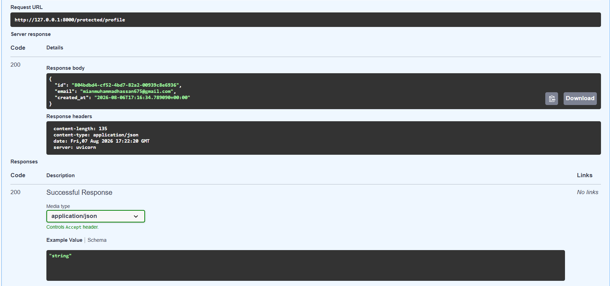
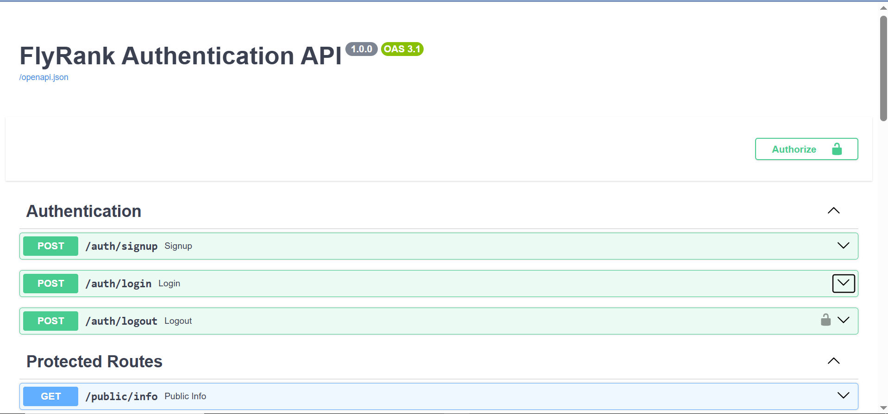

# 🔐 FlyRank Authentication API

A secure REST API built with Python, FastAPI, and Supabase Authentication.

This project implements user registration, login, JWT authentication, protected routes, reusable authentication dependencies, logout, and interactive Swagger API documentation.

Built as part of the FlyRank Internship – Backend Track – Week 4 – Authentication Assignment.


## 🚀 Features

- 🔐 Supabase Authentication
- 👤 User registration
- 🔑 User login
- 🎟️ JWT access tokens
- 🛡️ Server-side token verification
- 🔒 Protected API endpoints
- ♻️ Reusable FastAPI authentication dependency
- 🚪 Protected logout endpoint
- 📚 Interactive Swagger UI
- 🔒 Swagger Bearer authentication
- ❌ Invalid and expired token rejection
- 🌐 Public API endpoint
- ⚙️ Environment-based configuration
- 🧪 API testing with cURL and Swagger


## 🧠 Authentication Flow

1. Client sends email and password to Supabase.
2. Supabase authenticates the user.
3. Supabase returns an access token and refresh token.
4. Client sends the access token to the FastAPI backend.
5. FastAPI extracts the Bearer token.
6. FastAPI asks Supabase to verify the token.
7. If valid, the protected endpoint is allowed.
8. If invalid or expired, the API returns 401 Unauthorized.


## 🏗️ Architecture

┌──────────────┐
│    Client    │
└──────┬───────┘
       │
       │ Email + Password
       ▼
┌──────────────┐
│   Supabase   │
│     Auth     │
└──────┬───────┘
       │
       │ JWT Access Token
       ▼
┌──────────────┐
│   FastAPI    │
│    Server    │
└──────┬───────┘
       │
       │ Authorization: Bearer <JWT>
       ▼
┌────────────────────┐
│ Authentication     │
│ Dependency         │
└─────────┬──────────┘
          │
          │ Verify Token
          ▼
┌──────────────┐
│   Supabase   │
│ Token Check  │
└──────┬───────┘
       │
       ├── Valid ────► Protected Resource
       │
       └── Invalid ──► 401 Unauthorized
````

## 🛠️ Technology Stack

| Technology    | Purpose                       |
| ------------- | ----------------------------- |
| Python 3.13   | Programming language          |
| FastAPI       | REST API framework            |
| Uvicorn       | ASGI server                   |
| Supabase      | Authentication provider       |
| supabase-py   | Supabase Python SDK           |
| python-dotenv | Environment configuration     |
| Swagger UI    | API documentation and testing |
| Git           | Version control               |
| GitHub        | Source code hosting           |

## 📁 Project Structure

```text
Auth---Login-protect/
│
├── images/
│   ├── swagger-auth.png
│   └── protected-profile.png
│
├── app.py
├── auth.py
├── protected.py
├── dependencies.py
├── config.py
├── supabase_client.py
├── requirements.txt
├── .env
├── .env.example
├── .gitignore
└── README.md
```

## 🔑 API Endpoints

### Authentication

| Method | Endpoint       | Authentication | Description                          |
| ------ | -------------- | -------------- | ------------------------------------ |
| POST   | `/auth/signup` | ❌ No           | Create a new user account            |
| POST   | `/auth/login`  | ❌ No           | Authenticate user and receive tokens |
| POST   | `/auth/logout` | 🔒 Yes         | Log out the authenticated user       |

### Public

| Method | Endpoint       | Authentication | Description               |
| ------ | -------------- | -------------- | ------------------------- |
| GET    | `/public/info` | ❌ No           | Return public information |

### Protected

| Method | Endpoint               | Authentication | Description                           |
| ------ | ---------------------- | -------------- | ------------------------------------- |
| GET    | `/protected/profile`   | 🔒 Yes         | Return authenticated user information |
| GET    | `/protected/dashboard` | 🔒 Yes         | Example protected dashboard           |

## ⚙️ Installation

Clone the repository:

```bash
git clone https://github.com/mianhasssan/Auth---Login-protect.git
```

Enter the project:

```bash
cd Auth---Login-protect
```

Install dependencies:

```bash
pip install -r requirements.txt
```

## 🔐 Environment Variables

Create a `.env` file in the project root:

```env
SUPABASE_URL=your_supabase_project_url
SUPABASE_KEY=your_supabase_anon_key
PORT=8000
```

The `.env` file contains sensitive configuration and must NOT be committed to GitHub.

Use `.env.example` as the safe template:

```env
SUPABASE_URL=your_supabase_project_url
SUPABASE_KEY=your_supabase_anon_key
PORT=8000
```

## ▶️ Running the API

Start the FastAPI server:

```bash
uvicorn app:app --reload
```

The API will run at:

```text
http://127.0.0.1:8000
```

## 📚 Swagger API Documentation

FastAPI provides interactive Swagger documentation automatically.

Open:

```text
http://127.0.0.1:8000/docs
```

Swagger can be used to:

* Test signup
* Test login
* Obtain an access token
* Authorize with Bearer authentication
* Test protected routes
* Test invalid tokens
* Test logout

## 🔒 Swagger Bearer Authentication

The API uses HTTP Bearer authentication for protected routes.

The Swagger UI provides an Authorize button where you can enter your JWT.

Use:

```text
Bearer YOUR_ACCESS_TOKEN
```

After authorization, Swagger automatically sends:

```http
Authorization: Bearer <access_token>
```

with protected requests.

### Swagger Screenshot



## 🧪 API Testing

### 1. Signup

Request:

```bash
curl -X POST http://127.0.0.1:8000/auth/signup ^
-H "Content-Type: application/json" ^
-d "{\"email\":\"test@example.com\",\"password\":\"password123\"}"
```

Expected:

```text
201 Created
```

The response contains the Supabase user information.

### 2. Login

Request:

```bash
curl -X POST http://127.0.0.1:8000/auth/login ^
-H "Content-Type: application/json" ^
-d "{\"email\":\"test@example.com\",\"password\":\"password123\"}"
```

Expected:

```text
200 OK
```

Successful login returns authentication tokens:

```json
{
  "access_token": "...",
  "refresh_token": "..."
}
```

Copy the `access_token` for protected endpoint testing.

### 3. Public Information

The public endpoint does not require authentication.

Request:

```bash
curl -i http://127.0.0.1:8000/public/info
```

Expected:

```text
200 OK
```

Example response:

```json
{
  "message": "Welcome stranger! This info is public."
}
```

### 4. Protected Profile

The profile endpoint requires a valid access token.

Request:

```bash
curl -i http://127.0.0.1:8000/protected/profile ^
-H "Authorization: Bearer YOUR_ACCESS_TOKEN"
```

Expected:

```text
200 OK
```

Example response:

```json
{
  "id": "user-id",
  "email": "user@example.com",
  "created_at": "2026-08-07T..."
}
```

### Protected Profile Screenshot



### 5. Invalid Token

The API rejects invalid or modified JWTs.

Request:

```bash
curl -i http://127.0.0.1:8000/protected/profile ^
-H "Authorization: Bearer INVALID_TOKEN"
```

Expected:

```text
401 Unauthorized
```

Example response:

```json
{
  "detail": {
    "error": "Invalid or expired token"
  }
}
```

This confirms that the backend actually verifies the token instead of simply checking whether an Authorization header exists.

### 6. Missing Token

Request:

```bash
curl -i http://127.0.0.1:8000/protected/profile
```

Expected:

```text
401 Unauthorized
```

Example response:

```json
{
  "detail": {
    "error": "Access token required"
  }
}
```

### 7. Logout

Logout is protected and requires a valid access token.

Request:

```bash
curl -i -X POST http://127.0.0.1:8000/auth/logout ^
-H "Authorization: Bearer YOUR_ACCESS_TOKEN"
```

Expected:

```text
204 No Content
```

## ♻️ Reusable Authentication Dependency

Authentication logic is implemented as a reusable FastAPI dependency instead of being copied into every protected route.

The dependency performs the following steps:

1. Reads the Authorization header.
2. Checks the Bearer format.
3. Extracts the access token.
4. Sends the token to Supabase.
5. Verifies the token.
6. Returns the authenticated user.
7. Rejects invalid or expired tokens.

Conceptually:

```python
def get_current_user(authorization):
    # Check Authorization header
    # Extract Bearer token
    # Verify token with Supabase
    # Return authenticated user
```

Protected routes can then reuse the dependency:

```python
@router.get("/protected/profile")
def protected_profile(user=Depends(get_current_user)):
    return {
        "id": user.id,
        "email": user.email,
        "created_at": user.created_at
    }
```

Another protected route can use the exact same guard:

```python
@router.get("/protected/dashboard")
def dashboard(user=Depends(get_current_user)):
    return {
        "message": f"Welcome {user.email}",
        "dashboard": "Protected Dashboard"
    }
```

No authentication logic needs to be duplicated inside every route.

## 🔒 Security

This project follows the assignment's core security principle:

> Passwords are never stored or hashed by the backend application.

Supabase is responsible for authentication and password handling.

The backend is responsible for:

* Sending credentials to Supabase
* Receiving authentication tokens
* Extracting Bearer tokens
* Verifying tokens through Supabase
* Protecting API endpoints
* Returning 401 Unauthorized for invalid or expired tokens

## 🔐 Secrets Management

Never commit real credentials or authentication tokens to GitHub.

The following file must remain local:

```text
.env
```

Recommended `.gitignore`:

```gitignore
.env
__pycache__/
*.pyc
.venv/
venv/
```

The safe configuration template can be committed:

```text
.env.example
```

Never publish:

* Supabase secret keys
* JWT access tokens
* Passwords
* Refresh tokens
* Other private credentials

## 🏗️ Security Flow

```text
                    SIGN UP / LOGIN
                           │
                           ▼
                    ┌─────────────┐
                    │   Supabase  │
                    │     Auth    │
                    └──────┬──────┘
                           │
                     Access Token
                           │
                           ▼
                    ┌─────────────┐
                    │    Client   │
                    └──────┬──────┘
                           │
                 Authorization: Bearer JWT
                           │
                           ▼
                    ┌─────────────┐
                    │   FastAPI   │
                    └──────┬──────┘
                           │
                   Authentication
                     Dependency
                           │
                           ▼
                    ┌─────────────┐
                    │   Supabase  │
                    │ Verification│
                    └──────┬──────┘
                           │
                 ┌─────────┴─────────┐
                 │                   │
               Valid               Invalid
                 │                   │
                 ▼                   ▼
          Protected Route      401 Unauthorized
```

## 📸 API Screenshots

### Swagger UI

Swagger provides interactive API documentation and Bearer token authorization.


### Protected Profile

A successful authenticated request returns safe user profile metadata.


## ✅ Assignment Progress

| Stage   | Status     | Implementation                                |
| ------- | ---------- | --------------------------------------------- |
| Stage 0 | ✅ Complete | Supabase project and FastAPI server setup     |
| Stage 1 | ✅ Complete | Signup and login routes                       |
| Stage 2 | ✅ Complete | Public route and unverified protected route   |
| Stage 3 | ✅ Complete | Supabase JWT verification                     |
| Stage 4 | ✅ Complete | Reusable authentication dependency and logout |
| Stage 5 | ✅ Complete | Swagger UI with Bearer authentication         |

## 🎯 Learning Outcomes

This project demonstrates practical experience with:

* FastAPI REST API development
* Supabase Authentication
* User registration
* User login
* JWT authentication
* Bearer authentication
* Server-side token verification
* Protected API routes
* FastAPI dependency injection
* Reusable authentication logic
* Logout functionality
* Swagger/OpenAPI documentation
* API testing with cURL
* Environment variables
* Git and GitHub

## 👨‍💻 Author

**Muhammad Hassan**

Backend Developer | Python | FastAPI | REST APIs | Authentication

## 📄 Project Purpose

This project was developed as part of the **FlyRank Internship Backend Track** to demonstrate implementation of a secure authentication system using FastAPI and Supabase.

## 📌 License

This project is intended for educational and internship purposes.

````
